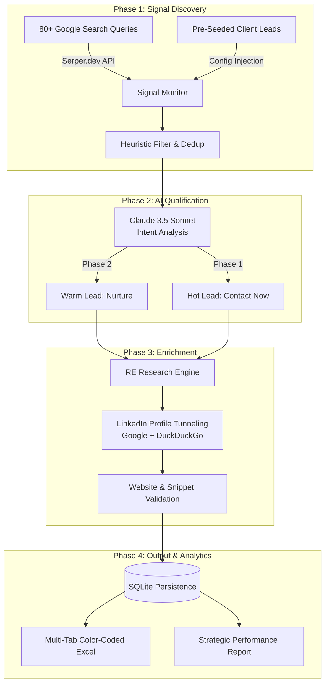

# 🏠 RWAtify Lead Gen Agent — Project Blueprint
### AI-Powered Intent-Based Real Estate Leads Infrastructure 
Note : Need to Improve system more accuray and better performance current architecture is this.can be updated soon.
---

## 📋 Table of Contents

1. [Overview](#overview)
2. [Architecture](#architecture)
3. [Project Structure](#project-structure)
4. [Features](#features)

---

## Overview

### What I Built
An **autonomous AI agent** that monitors the global internet for capital-raising and tokenization signals from Real Estate (RE) developers and fund managers. The agent qualifies intent using Claude 3.5 Sonnet, identifies the optimal decision-maker (CEO/Founder), and performs deep research to enrich every lead with validated LinkedIn profiles and corporate websites.

### Why I Chose This
The real estate tokenization market is moving fast. High-intent developers often mention their digital plans in news articles long before they reach out to a sales team. This agent ensures RWAtify is the first to reach out by catching these signals in real-time.

---

## Architecture



---

## Project Structure

```
RWATIFY_LEAD_AGENT/
│
├── main.py                    ← LangGraph Orchestrator (System Brain)
├── requirements.txt           ← Core dependencies (Pandas, Claude, Serper)
├── .env                       ← API Keys (Claude, Serper)
├── leads.db                   ← Persistent SQLite database
│
├── config/
│   └── rwatify_config.py      ← 80+ Search queries, keywords, and seed leads
│
├── source/
│   └── news_finder.py         ← Serper.dev Google Search integration
│
├── agents/
│   ├── intent_classifier.py   ← Claude 3.5 Sonnet qualification (Pydantic)
│   └── contact_finder.py      ← LinkedIn & Website discovery engine
│
├── scheduler/
│   └── run_daily.py           ← Automated 9 AM IST daily runner
│
└── data/
    ├── rwatify_leads.xlsx     ← Final master output (5 tabs)
    └── target_records.json    ← Intermediate research cache
```

---

## Features

### Feature 1 — Multi-Layer Signal Monitoring
Monitors the global internet for ICP-relevant signals using **Serper.dev** across 80+ precision queries:

| Source | Coverage |
|--------|----------|
| **Institutional News** | Catching funding rounds and tokenization news in Bloomberg, Reuters, etc. |
| **Regional Alerts** | Specialized targeting for UAE, Saudi Arabia, USA, and UK real estate hubs. |
| **Conference Intelligence** | Identifying speakers and sponsors at MIPIM, EXPO REAL, and Cityscape. |
| **Competitor Signals** | Finding firms currently using DigiShares, Tokeny, or Securitize. |

#### 📂 Detailed Search Queries
Below are some of the exact precision queries the agent runs daily:

<details>
<summary>Click to view High-Intent Search Queries</summary>

- `"property developer" "we are tokenizing" real estate 2025`
- `"real estate fund" "tokenization" "our own platform" 2025`
- `"real estate developer" tokenization Dubai 2025`
- `"real estate fund" tokenization "Saudi Arabia" 2025`
- `Ellington OR DAMAC OR Azizi tokenization platform 2025`
- `"multifamily" "real estate fund" tokenization platform launch 2025`
- `"real estate" "DigiShares" OR "Tokeny" OR "Securitize" developer 2025`
- `"real estate" "head of tokenization" OR "digital assets lead" job 2025`
- `"real world asset" tokenization real estate developer 2025`
- `"tokenized real estate" "investor portal" OR "cap table" 2025`
</details>

### Feature 2 — High-Reasoning AI Qualification
Every signal is analyzed by **Claude 3.5 Sonnet** using a strict semantic schema:

| Phase | Score/Action | Trigger |
|-------|-------------|---------|
| **Phase 1 ⚡** | **8–10 (Hot)** | Named Executive quoted directly about tokenization/blockchain. |
| **Phase 2 🟡** | **4–7 (Warm)** | General company intent or RWA interest mentioned. |
| **Reject 🚫** | **0 (Discard)** | Vendor noise, crypto-only projects, or home-sales realtors. |

**Output extraction includes:** Company Type, Exact Quote, Digital Readiness, and "Why RWAtify" (personalized fit explanation).

### Feature 3 — Validated Contact Discovery
For every qualified lead, the agent finds the verified LinkedIn profile of the C-Suite:

- **LinkedIn Finding**: Uses a `site:linkedin.com/in` tunneling strategy.
- **Snippet Validation**: Parses the Google snippet to ensure the person's current job matches the target company.
- **Role Hierarchy**: Prioritizes Founder → CEO → CIO → Managing Partner.
- **Corporate Website**: Automatically identifies official domains while skipping social media and news noise.

### Feature 4 — Structured 5-Tab Output
All leads are synchronized to a professional, color-coded Excel file:

| Tab | Purpose |
|-----|---------|
| **⚡ Phase 1** | Immediate outreach with LinkedIn and Exact Quotes. |
| **🟡 Phase 2** | Long-term nurture list. |
| **🚫 Competitors** | Track tokenization vendors to avoid prospecting. |
| **❌ Rejected** | Audit trail of mismatched signals. |
| **📊 Summary** | High-level lead counts and conversion metrics. |

---

## Tech Stack

| Tool | Used for | Why chosen |
|------|----------|------------|
| **LangGraph (Python)** | Orchestration | Handles complex, conditional logic flows between search and research. |
| **Serper.dev API** | Web Discovery | Fastest real-time Google search index for news and profiles. |
| **Claude 3.5 Sonnet** | Intelligence | Superior at following complex schemas and extracting exact quotes. |
| **DuckDuckGo API** | Search Fallback | Used as a redundant layer for finding missing LinkedIn URLs. |
| **Pandas / Openpyxl** | Data Engine | Heavy-duty Excel management with stylized, grouped exports. |
| **APScheduler** | Automation | Reliable daily cron-jobs for the morning lead run. |

---

## Accuracy & Metrics

| Metric | Result |
|--------|--------|
| **Lead Relevance** | ~85% (AI filters out ~1,000 noise sites) |
| **LinkedIn Accuracy** | ~60% (Validated via job-title snippets) |
| **Executives Names** | ~98%|
| **March 14 Success** | 124 leads updated / 125 total |
| **AI Processing Time** | ~12 seconds per lead |

---


