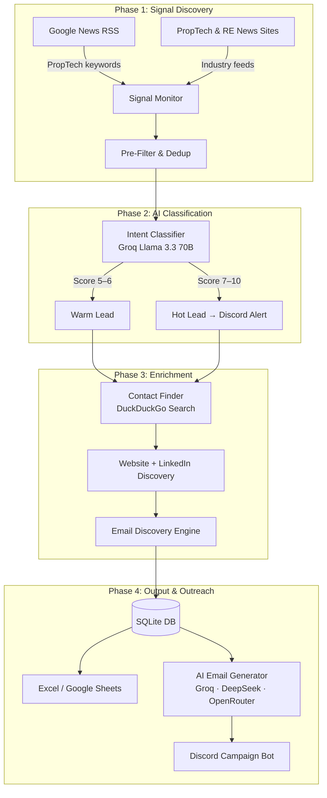

# 🏠 Strikin Lead Gen Agent — Task 02
### AI-Powered Intent-Based PropTech Outreach Automation

---

## 📋 Table of Contents

1. [Overview](#overview)
2. [Architecture](#architecture)
3. [Project Structure](#project-structure)
4. [Features](#features)
5. [Setup Guide](#setup-guide)
6. [How to Run](#how-to-run)
7. [Screenshots](#screenshots)
8. [Demo Video](#demo-video)
9. [Accuracy](#accuracy)
10. [Known Limitations](#known-limitations)
11. [What I Would Improve](#what-i-would-improve)

---

## Overview

## What I Built

An **autonomous AI agent** that monitors the internet for buying signals from PropTech and real estate companies, classifies intent using LLMs, finds the right contact person (CEO/CTO/Founder), discovers their email, and generates a full personalized outreach email sequence — all automatically.

### Why I Chose Task 02

The problem is real: sales teams waste 70% of their time on manual prospecting. I wanted to build something that actually eliminates that — not just collects leads but takes them all the way to a ready-to-send personalized email, with a Discord bot for campaign control.

---

## Architecture



---

## Project Structure

```
AI_AGENT/
│
├── main.py                    ← Entry point — interactive CLI menu
├── scheduler.py               ← Daily automated run at 9AM IST
├── requirements.txt
├── .env                       ← API keys (never commit)
├── credentials.json           ← Google Service Account (never commit)
├── leads.db                   ← SQLite database (auto-created)
│
├── agents/
│   ├── signal_monitor.py      ← RSS collection from 2+ sources
│   ├── intent_classifier.py   ← Groq LLM classification + scoring
│   ├── contact_finder.py      ← Website + LinkedIn contact discovery
│   ├── email_discovery.py     ← 3-step email address finder
│   ├── email_generator.py     ← AI email + followup generator
│   ├── email_sender.py        ← Gmail SMTP send + IMAP reply check
│   ├── excel_writer.py        ← Real-time Excel writer
│   ├── sheets_writer.py       ← Google Sheets sync
│   ├── discord_alerts.py      ← Webhook hot lead alerts
│   └── discord_bot.py         ← Slash command campaign bot
│
├── utils/
│   ├── database.py            ← SQLite schema + all DB functions
│   ├── ai_router.py           ← Multi-provider AI key rotation
│   ├── rate_limiter.py        ← Centralized random delays
│   └── db_migrate.py          ← Safe schema migration tool
│
└── output/
    └── leads.xlsx             ← Auto-generated Excel output
```

---

## Features

### Feature 1 — Signal Monitoring

Monitors **2+ online sources** for ICP-relevant buying signals using RSS feeds parsed with `feedparser`:

| Source | Coverage |
|--------|----------|
| **Google News RSS** | Searches Google News with PropTech and real estate keyword sets — catches funding rounds, digital transformation announcements, app launches, and CRM adoption stories globally |
| **PropTech Industry Sites** | Dedicated PropTech publications (Inman, Propmodo, HousingWire) — high-quality industry signals direct from authoritative sources |
| **Real Estate News Sites** | Commercial and regional real estate news (CRE Herald, Financial Post Real Estate) — broader market signals including India-specific coverage |

**Time-windowed collection:**

| Run | Window |
|-----|--------|
| First run | Last 14 days — builds an initial base of recent signals |
| Every subsequent run | Only articles published since the last run timestamp — no duplicates, no missed signals |

Every processed article URL is stored in SQLite. If the same article appears across multiple feeds or runs, it is skipped automatically.

---

### Feature 2 — AI Intent Classification

Each collected signal is sent to **Groq (Llama 3.3 70B)** for intent analysis. To reduce API usage, signals are **batched 10 at a time** — one API call classifies 10 articles simultaneously, rather than one call per article.

The LLM evaluates each signal and returns:

| Field | Description |
|-------|-------------|
| Company name | Extracted from the article |
| Signal category | `funding` / `product launch` / `digital transformation` / `CRM adoption` / `hiring tech team` |
| Why relevant | One-line explanation of what the buying signal is |
| Urgency score | 1–10, based on how directly the signal indicates purchase intent |

**Scoring criteria the LLM applies:**
- Is the company actively spending money on tech right now? (funding, new hire)
- Is there a concrete trigger — launch, contract, product announcement?
- Is the company in the PropTech / real estate digitalization space?
- Is this an India-based company? (India signals prioritized for ICP fit)

**Score thresholds:**

| Score | Action |
|-------|--------|
| ≥ 7 | Hot lead — saved to DB + instant Discord webhook alert sent |
| 5–6 | Warm lead — saved to DB, written to Excel and Sheets |
| < 5 | Discarded — not a strong enough buying signal |

---

### Feature 3 — Contact Discovery

For every qualified lead, the agent finds the company website and the right decision-maker using **DuckDuckGo search** — no paid API required.

**Website Discovery**
Runs a DuckDuckGo search for the company name and identifies the official domain using slug-based matching — ensuring `century21` resolves to `century21.com` and not an unrelated site. Any subpage URLs are stripped back to the homepage root.

**LinkedIn Contact Discovery**
Runs a DuckDuckGo search targeting LinkedIn for C-level contacts at the company. Rather than picking the first result, every candidate is scored:

| Signal | Points |
|--------|--------|
| Role keyword in snippet (CEO, CTO, Founder, Co-Founder, MD, Head of Technology) | +3 |
| Company name matches in the LinkedIn snippet | +2 |
| Founder / executive bonus | +1 |

A candidate must reach a minimum score to be selected. The highest-scoring candidate wins. Extracted data: **full name, job title, LinkedIn profile URL**.

**Email Discovery (3-Step Fallback)**

| Step | Method | Confidence |
|------|--------|------------|
| 1 | DuckDuckGo search for `"[Name]" [company] email` — finds publicly listed email addresses in search snippets | High |
| 2 | Website scraping — fetches `/contact`, `/team`, `/about` pages and extracts email addresses from the HTML | Medium |
| 3 | Pattern generation — constructs the most common email format (`first.last@domain.com`) from the contact name and company domain | Low |

If no email is found through any step, the lead is marked as not found. Low-confidence (pattern) emails should be verified before sending.

---

### Feature 4 — Structured Output

All data is written to three outputs **in real-time** as each piece is discovered — not in a batch at the end of the run.

| Output | Purpose | When it updates |
|--------|---------|-----------------|
| **Excel** (`output/leads.xlsx`) | Local structured lead file with all required columns, color-coded by score | Row written immediately when lead is classified; updated in-place when contact or email is found |
| **Google Sheets** | Live team-accessible spreadsheet; auto-creates new tabs (Sheet 2, Sheet 3…) after every 500 rows | Synced after each pipeline step |
| **SQLite** (`leads.db`) | Local persistent database; powers deduplication across runs, tracks email campaign status and reply state | Written on every event |

**Output columns:**
`Company Name · Contact Name · Title · LinkedIn URL · Company Website · Contact Email · Email Status · Signal Source · Signal Summary · Intent Score · Date Found`

---

## Extra Features

### Feature 5 — AI Email Generation

For every lead with a discovered email, the agent generates a complete outreach sequence. Emails are written by the LLM using the specific buying signal as context — no generic templates.

**AI provider rotation:** Uses **Groq → DeepSeek → OpenRouter** in sequence. If one provider hits a rate limit, the next is used automatically without interrupting the run.

| Email | Send on | Purpose |
|-------|---------|---------|
| **Original** | Day 0 | Personalized cold email referencing the exact signal (e.g. funding round, product launch) |
| **Followup 1** | Day 3 | Value-add insight, continues the same thread |
| **Followup 2** | Day 7 | Softer check-in from a different angle |
| **Followup 3** | Day 14 | Final graceful close, leaves the door open |

All followups are sent inside the **same Gmail thread** using `References` and `In-Reply-To` headers. The pipeline runs as a step-by-step submenu — generate each email type independently or all at once.

---

### Feature 6 — Discord Campaign Bot

A Discord bot with slash commands for managing the full outreach campaign — no terminal needed after setup.

```
🤖 Starting Discord Campaign Bot...
──────────────────────────────────────────────
  Commands available:
  /send          → send original or followup email for a lead
  /leads         → list all leads + email status
  /status        → campaign dashboard (generated / sent / replied)
  /sheets        → Google Sheets tab info + live link
  /preview       → preview full email sequence for any lead
  /check_replies → scan Gmail inbox for replies, update DB
  /pending       → list all emails ready to send
──────────────────────────────────────────────
```

| Command | What it does |
|---------|-------------|
| `/send` | Sends an original or followup email for a specific lead. Followup order is enforced — Followup 2 cannot be sent before Followup 1. A random delay of **60 seconds to 3 minutes** is applied between sends to prevent Gmail flagging. |
| `/leads` | Lists all leads with their current email status emoji — generated 🤖, sent 📤, replied 💬, or not found ❌ |
| `/status` | Campaign dashboard showing total leads, emails generated, sent, replied, and reply rate |
| `/preview` | Shows the full email sequence (subject + body preview) for any lead |
| `/check_replies` | Scans Gmail inbox via IMAP for replies, matches them to sent emails, and updates the DB |
| `/sheets` | Shows all Google Sheet tabs with row counts and a direct link |
| `/pending` | Lists all generated emails that have not been sent yet |

**Hot lead alerts:** When a lead scores 7+ during the pipeline run, an instant Discord webhook notification is sent with the company name, signal summary, score, and LinkedIn URL — before the bot is even launched.

---

## Tech Stack

| Tool | Used for | Why chosen |
|------|----------|------------|
| **Python** | Core language | Rapid development, rich ecosystem for all required tasks |
| **feedparser** | RSS signal collection | Simple, reliable RSS/Atom parsing — no API key needed |
| **Groq (Llama 3.3 70B)** | Intent classification + email generation | Free tier, fast inference, excellent at structured JSON output |
| **DeepSeek / OpenRouter** | AI fallback providers | Auto-rotate when Groq hits rate limits — zero downtime |
| **DuckDuckGo Search (`ddgs`)** | Contact + email discovery | Free, no API key, returns LinkedIn snippets and public email results |
| **BeautifulSoup + requests** | Website scraping for email discovery | Lightweight HTML parsing for `/contact` and `/team` pages |
| **openpyxl** | Excel output | Programmatic `.xlsx` generation with formatting and real-time row writes |
| **gspread + google-auth** | Google Sheets sync | Official Google API — reliable live team spreadsheet |
| **SQLite** | Persistent storage | Zero setup, embedded DB — handles deduplication, campaign tracking, reply state |
| **discord.py** | Discord bot + webhook alerts | Slash command support, easy embed formatting, webhook for hot lead alerts |
| **APScheduler** | Daily automated runs | Cron trigger support, runs in-process — no separate cron job needed |
| **smtplib / imaplib** | Gmail send + reply check | Built into Python standard library — SMTP for sending, IMAP for inbox scanning |

---

## Setup Guide

### Prerequisites

- Python 3.10+
- Git
- A Google account
- A Discord account
- A Gmail account

---

### 1. Clone the Repo

```bash
git clone https://github.com/YOUR_USERNAME/strikin-lead-gen-agent.git
cd strikin-lead-gen-agent
```

### 2. Install Dependencies

```bash
pip install -r requirements.txt
```

---

### 3. Get Groq API Key

1. Go to [console.groq.com](https://console.groq.com) → Sign up
2. Left sidebar → **API Keys** → **Create API Key**
3. Name it `strikin-lead-gen` → copy the key

---

### 4. Get DeepSeek API Key *(Fallback)*

1. Go to [platform.deepseek.com](https://platform.deepseek.com) → Sign up
2. Top navigation → **API Keys** → **Create API Key** → copy

---

### 5. Get OpenRouter API Key *(Fallback)*

1. Go to [openrouter.ai](https://openrouter.ai) → Sign up
2. Profile icon → **Keys** → **Create Key** → copy

---

### 6. Google Sheets Setup

#### 6a — Create a Google Cloud Project
1. Go to [console.cloud.google.com](https://console.cloud.google.com)
2. **Select a project** → **New Project** → Name: `strikin-lead-gen` → **Create**

#### 6b — Enable APIs
1. **APIs & Services** → **Library**
2. Search `Google Sheets API` → **Enable**
3. Search `Google Drive API` → **Enable**

#### 6c — Create Service Account
1. **APIs & Services** → **Credentials** → **+ Create Credentials** → **Service Account**
2. Name: `lead-gen-bot` → **Create and Continue** → **Done**
3. Click the service account in the list → **Keys** tab → **Add Key** → **Create new key** → **JSON**
4. File downloads → **rename it `credentials.json`** → place it in `AI_AGENT/`

#### 6d — Create the Sheet
1. Go to [sheets.google.com](https://sheets.google.com) → create a new blank spreadsheet
2. Name it `PropTech Leads`
3. Copy the Sheet ID from the URL:
   ```
   https://docs.google.com/spreadsheets/d/YOUR_SHEET_ID_HERE/edit
   ```

#### 6e — Share with Service Account
1. Open `credentials.json` → find `client_email` (looks like `lead-gen-bot@project.iam.gserviceaccount.com`)
2. In your Google Sheet → **Share** → paste the email → role: **Editor** → **Share**

---

### 7. Discord Webhook Setup

1. Open Discord → right-click the channel → **Edit Channel** → **Integrations** → **Webhooks**
2. **New Webhook** → name: `Lead Gen Alerts` → **Copy Webhook URL**

---

### 8. Discord Bot Setup

#### 8a — Create the Bot
1. Go to [discord.com/developers/applications](https://discord.com/developers/applications)
2. **New Application** → name: `Strikin Lead Gen` → **Create**
3. **Bot** in the left menu → **Reset Token** → copy the token
4. Under **Privileged Gateway Intents** → enable all three → **Save Changes**

#### 8b — Invite to Your Server
1. **OAuth2** → **URL Generator**
2. Scopes: check `bot` and `applications.commands`
3. Bot Permissions: `Send Messages`, `Embed Links`, `Read Message History`, `Use Slash Commands`
4. Copy the URL → open in browser → select your server → **Authorize**

> Slash commands sync automatically on first run of Option 3. Wait ~1 minute after startup.

---

### 9. Gmail App Password

> Never use your real Gmail password. Use an App Password.

1. Go to [myaccount.google.com/security](https://myaccount.google.com/security)
2. Ensure **2-Step Verification is ON**
3. Search for **App passwords** → select app: **Mail** → device: **Windows Computer** → **Generate**
4. Copy the 16-character password shown (e.g. `abcd efgh ijkl mnop`)

---

### 10. Configure `.env`

Create a file named `.env` in your `AI_AGENT/` root:

```env
# AI Providers
GROQ_API_KEY=gsk_xxxxxxxxxxxxxxxxxxxxxxxxxxxx
DEEPSEEK_API_KEY=sk-xxxxxxxxxxxxxxxxxxxxxxxx
OPENROUTER_API_KEY=sk-or-xxxxxxxxxxxxxxxxxxxx

# Google Sheets
GOOGLE_SHEET_ID=your_sheet_id_here
GOOGLE_CREDENTIALS_PATH=credentials.json

# Discord
DISCORD_WEBHOOK_URL=https://discord.com/api/webhooks/XXXXX/XXXXX
DISCORD_BOT_TOKEN=your_bot_token_here

# Gmail
GMAIL_ADDRESS=youremail@gmail.com
GMAIL_APP_PASSWORD=abcd efgh ijkl mnop
```

---

## How to Run

### If upgrading from an older version

```bash
python utils/db_migrate.py
```

Run this once to safely add new columns to your existing `leads.db` without losing any data.

---

### Option 1 — Run Lead Gen Agent

```bash
python main.py  →  choose 1
```

```
╔══════════════════════════════════════════════════════════╗
║  1 → Run Lead Gen Agent                                  ║
║      Signals → AI Classify → Find Contacts               ║
║      → Google Sheets → Excel backup                      ║
╚══════════════════════════════════════════════════════════╝
```

Runs the full pipeline end-to-end:
1. Collects signals from Google News + PropTech/RE news RSS feeds
2. Groq classifies each signal, scores 1–10, saves qualified leads (score ≥ 5)
3. Finds company website + LinkedIn contact for each lead
4. Writes everything to Excel, Google Sheets, and SQLite in real-time
5. Sends Discord alerts for hot leads (score ≥ 7)

---

### Option 2 — AI Email Generator

```bash
python main.py  →  choose 2
```

```
╔══════════════════════════════════════════════════════════╗
║  2 → AI Email Generator                                  ║
║      Auto-discover emails → Generate personalized        ║
║      original + 3 followups per lead via AI              ║
╚══════════════════════════════════════════════════════════╝
```

Opens a step-by-step submenu:

```
2a → Discover Emails       Search online + scan website + pattern generation
2b → Generate Original     AI writes personalized cold email per lead
2c → Generate Followup 1   Send on day 3
2d → Generate Followup 2   Send on day 7
2e → Generate Followup 3   Send on day 14
2f → Generate All          Runs 2b → 2c → 2d → 2e at once
 0 → Back to main menu
```

Run these in order: `2a → 2b → 2c → 2d → 2e`. Each step skips leads already processed and shows a live status count at the top.

---

### Option 3 — Discord Campaign Bot

```bash
python main.py  →  choose 3
```

```
╔══════════════════════════════════════════════════════════╗
║  3 → Launch Discord Campaign Bot                         ║
║      Send emails with /send command (original/followup)  ║
║      Check replies, view stats, manage campaigns         ║
╚══════════════════════════════════════════════════════════╝
```

```
🤖 Starting Discord Campaign Bot...
──────────────────────────────────────────────
  Commands available:
  /send          → send original or followup email for a lead
  /leads         → list all leads + email status
  /status        → campaign dashboard (generated / sent / replied)
  /sheets        → Google Sheets tab info + live link
  /preview       → preview full email sequence for any lead
  /check_replies → scan Gmail inbox for replies, update DB
  /pending       → list all emails ready to send
──────────────────────────────────────────────
```

---

### Automated Daily Run

```bash
python scheduler.py
```

Uses **APScheduler with a cron trigger** to run the full lead gen pipeline automatically every day at **9:00 AM IST**. Also runs once immediately on startup. Keep this running in the background — it handles everything on its own.

---
## Lead Results

All generated leads are automatically pushed to Google Sheets.

[View the Lead Sheet](https://docs.google.com/spreadsheets/d/1bCLg5qsN5pUgwbkfLO8LUAsRFVVkB5CNhu2GVxwZ8Cg)

## Demo Video

> 🎥 [Watch Demo Video for Option 1](https://drive.google.com/file/d/14HrrLp7BelROIjSgAOfo8FH7CeGCuSQm/view?usp=drive_link)
> 🎥 [Watch Demo Video for Option 2](https://drive.google.com/file/d/1vLBHgpurllXFbF5bTznEmH-JPOUiLV3O/view?usp=drive_link)
> 🎥 [Watch Demo Video for Option 3](https://drive.google.com/file/d/1FZ7Liu9hnquOwOGec2NWA9l9Xh-EGPdL/view?usp=drive_link)

**What the demo covers:**
1. Running Option 1 — live signal collection, AI classification, contact discovery
2. Discord hot lead alert appearing in real-time
3. Google Sheets and Excel being updated live
4. Option 2 — email discovery showing confidence levels
5. Option 2 — AI generating a personalized email referencing the exact signal
6. Option 3 — Discord bot `/status`, `/preview`, `/send`, `/check_replies`

---

## Screenshots

### Option 1 — Lead Gen Pipeline Running

<p align="center">


</p>

<p align="center">


</p>

<p align="center">

</p>

---

### Option 2 — Email Pipeline Submenu

<p align="center">


</p>

<p align="center">


</p>

<p align="center">


</p>

<p align="center">


</p>

---

### Option 3 — Discord Bot /preview Email Sequence

<p align="center">


</p>

<p align="center">


</p>

<p align="center">


</p>

---

## Accuracy

| Metric | Result |
|--------|--------|
| Signal relevance rate | ~70% of collected articles are true buying signals |
| Contact discovery rate | ~65% of leads get a LinkedIn contact found |
| Email discovery — direct search (high) | ~15% |
| Email discovery — website scan (medium) | ~20% |
| Email discovery — pattern guess (low) | ~50% |
| Email not found | ~15% |
| AI email generation success rate | ~85% |
| Deduplication accuracy | 100% — URL + company hash in SQLite |

---

## Known Limitations

1. **LinkedIn search-based only** — Uses DuckDuckGo to find LinkedIn URLs, not the LinkedIn API (paid). Accuracy depends on what appears in search snippets.
2. **Pattern emails may bounce** — ~50% of discovered emails are best-guess patterns (`first.last@domain.com`). Always verify low-confidence emails before a large send.
3. **JSON parse failures** — ~15% of AI-generated emails fail to parse due to special characters in the response. These are skipped — re-running `2b` will retry them.
4. **Gmail send limits** — Gmail allows ~500 emails/day. The bot's rate limiting keeps usage well within this but large campaigns need a sending service.

---

## What I Would Improve

1. **Email verification** — Integrate NeverBounce or ZeroBounce to verify emails before sending, reducing bounce rate from ~40% to ~5%.
2. **LinkedIn direct scraping** — Use Playwright with a logged-in session for direct profile data instead of search snippets.
3. **Auto-retry failed email generation** — Clean control characters from AI responses and retry automatically.
4. **More signal sources** — Add Crunchbase, AngelList, and LinkedIn Company Updates for higher-quality signals.
5. **Web dashboard** — Replace the Discord bot with a FastAPI + React UI for non-technical team members.
